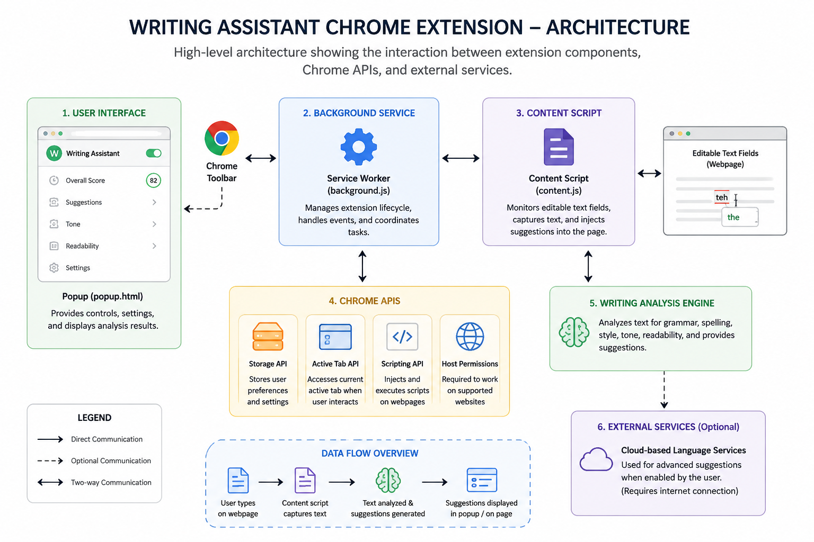

# Writing Assistant Chrome Extension

## Technical Overview

**Version:** 1.0

**Last Updated:** June 2026

## Table of Contents

- [Overview](#overview)
- [Purpose](#purpose)
- [System Architecture](#system-architecture)
- [Project Structure](#project-structure)
- [Technology Stack](#technology-stack)
- [Core Components](#core-components)
- [Writing Assistance Workflow](#writing-assistance-workflow)
- [Data Flow](#data-flow)
- [Extension Lifecycle](#extension-lifecycle)
- [Permission Model](#permission-model)
- [Security Considerations](#security-considerations)
- [Performance Considerations](#performance-considerations)
- [Limitations](#limitations)
- [Future Improvements](#future-improvements)

## Overview

| Item | Value |
|------|-------|
| Project | Writing Assistant Chrome Extension |
| Document | Technical Overview |
| Version | 1.0 |
| Last Updated | June 2026 |
| Platform | Google Chrome (Manifest V3) |

This document provides a technical overview of the Writing Assistant Chrome Extension. It describes the overall architecture, project structure, major components, extension workflow, data flow, and implementation approach used by the extension.

## Purpose

The Writing Assistant Chrome Extension helps users improve their writing directly within supported web pages by providing grammar checking, spelling correction, readability improvements, vocabulary enhancement, and writing suggestions.

The extension performs writing analysis while maintaining a lightweight architecture that integrates seamlessly with Chromium-based browsers.

## System Architecture

The extension follows a modular architecture where Google Chrome hosts the extension. Content scripts interact with editable text fields, background services coordinate extension behavior, and the popup interface allows users to configure writing assistance.



## Project Structure

```text
writing-assistant-chrome-extension/
├── images/
├── docs/
├── manifest.json
├── popup.html
├── popup.js
├── background.js
├── content.js
├── styles.css
├── README.md
└── LICENSE.md
```

The `background.js` file manages extension events and browser interactions, while `content.js` interacts with supported webpages to detect editable text fields and provide writing suggestions. The popup files (`popup.html` and `popup.js`) implement the extension's user interface.

The project structure separates extension logic, user interface components, browser integration, and documentation to simplify maintenance and future development.

## Technology Stack

### Programming Language

- JavaScript

### User Interface

- HTML5
- CSS3

### Browser APIs

- Chrome Extension API
- Storage API
- Active Tab API
- Scripting API

### Development Tools

- Visual Studio Code
- Git
- GitHub

## Core Components

### Manifest

Defines extension metadata, permissions, commands, and browser integration using Manifest V3.

### Background Service Worker

Handles extension lifecycle events, browser events, and background processing.

### Content Script

Detects editable text fields, analyzes user input, and displays writing suggestions.

### Popup Interface

Provides controls for enabling writing assistance, viewing suggestions, and accessing settings.

### Settings Manager

Stores user preferences using Chrome Storage API.

## Writing Assistance Workflow

The writing workflow follows the process below.

```text
User
   │
   ▼
Editable Text Field
   │
   ▼
Content Script
   │
   ▼
Writing Analysis
   │
   ▼
Suggestion Generation
   │
   ▼
Inline Suggestions
   │
   ▼
User Accepts or Ignores Suggestion
```

The extension continuously analyzes supported text fields and provides writing suggestions without requiring users to leave the current webpage.

## Data Flow

The extension processes information using the following workflow.

```text
User Input
      │
      ▼
Content Script
      │
      ▼
Writing Analysis
      │
      ▼
Suggestion Engine
      │
      ▼
Popup / Inline Suggestions
      │
      ▼
User Interaction
```

Writing analysis is performed locally by default. Advanced writing suggestions may optionally use cloud-based language services, depending on the extension configuration.

## Extension Lifecycle

The extension lifecycle consists of the following stages:

```text
Browser Starts
      │
      ▼
Extension Loaded
      │
      ▼
Service Worker Activated
      │
      ▼
Content Script Injected
      │
      ▼
User Opens Supported Website
      │
      ▼
Writing Assistance Enabled
```

Manifest V3 service workers become inactive when idle and reactivate automatically when extension events occur.

## Permission Model

The extension requests only the permissions required for its functionality.

| Permission | Purpose |
|------------|---------|
| `storage` | Saves user preferences and settings |
| `activeTab` | Accesses the currently active webpage when required |
| `scripting` | Injects content scripts into supported webpages |

## Security Considerations

The extension follows Chrome Extension Manifest V3 security best practices.

Security measures include:

- Manifest V3 architecture
- Local text processing by default
- Optional cloud-based language services for advanced suggestions
- Minimal permission model
- Secure browser API usage
- No unauthorized background data collection
- User preferences stored locally
- No personal data transmitted without user interaction

## Performance Considerations

The extension is designed for efficient browser performance.

Performance characteristics include:

- Lightweight content scripts
- Event-driven service worker
- Low memory usage
- Efficient text analysis
- Minimal browser resource consumption

## Limitations

Current limitations include:

- Chromium-based browsers only
- Limited support for some rich text editors
- Enterprise websites using strict Content Security Policies (CSP) may restrict extension functionality
- Closed Shadow DOM implementations may prevent content script interaction
- Advanced writing suggestions may require an internet connection
- English language support only

## Future Improvements

Future releases may include:

- AI-powered writing suggestions
- Multi-language support
- Offline grammar engine
- Custom writing styles
- User dictionary
- Cloud synchronization
- Writing history
- PDF export
- Cross-browser support
